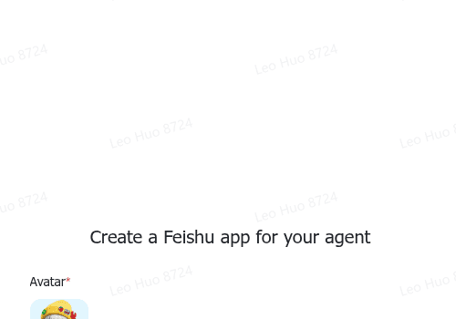
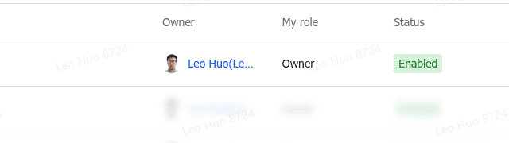
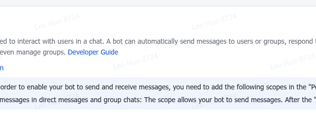
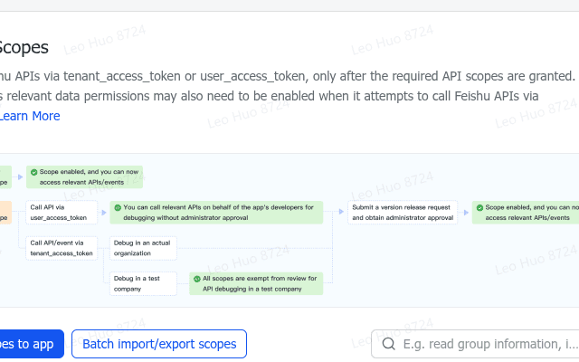
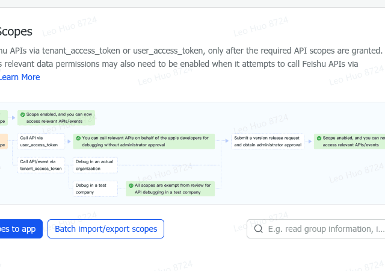

# Atim

**AI Agent through IM** — Talk to Claude Code (and soon other AI coding agents) through Telegram or Feishu.

```
Telegram / Feishu  ↔  tmux  ↔  Claude Code
```

Atim bridges an IM chat directly to a tmux window running an AI coding agent. Type in Telegram — it reaches the agent's terminal. The agent responds — you see it in Telegram.

## Quick Install

Download and install to ~/.local/bin with `installer.sh` with `curl`:

```bash
curl -fsSL https://raw.githubusercontent.com/zitsen/atim/main/install.sh | bash
```

Or with `wget`:

```bash
wget -qO- https://raw.githubusercontent.com/zitsen/atim/main/install.sh | bash
```

Install to a custom path:

```bash
curl -fsSL https://raw.githubusercontent.com/zitsen/atim/main/install.sh | bash -s -- -b /usr/local/bin
```

The installer downloads a statically-linked musl binary from the latest GitHub release.

## Features

- **Multi-IM**: Telegram (stable) + Feishu/Lark (beta)
- **Multi-agent**: Claude Code, Copilot CLI, Codex CLI — auto-detected by pane inspection
- **Topic isolation**: Each Telegram topic groups → a dedicated tmux window
- **Interactive UIs**: Inline keyboards for directory browsing, window picking, session selection
- **Voice messages**: Whisper transcription via OpenAI API
- **Efficient monitoring**: Byte-offset tracking of Claude Code JSONL session logs
- **Flood control**: Per-chat rate limiting with content-aware message merging

## Architecture

```
  ┌──────────────┐     ┌──────────────────────────┐     ┌──────────────┐
  │  Telegram    │     │     Atim Server          │     │   Feishu     │
  │  Bot API     │ <-> │                          │ <-> │   Bot API    │
  └──────────────┘     │  ┌──────┐  ┌───────────┐ │     └──────────────┘
                       │  │ Queue│  │  Monitor  │ │
                       │  └──┬───┘  └─────┬─────┘ │
                       │     │            │       │
                       │  ┌──┴────────────┴───┐   │
                       │  │    State + Tmux   │   │
                       │  └────────┬──────────┘   │
                       └───────────┼──────────────┘
                                   │
                          ┌────────┴────────┐
                          │  tmux session   │
                          │  ┌────────────┐ │
                          │  │ Claude Code│ │
                          │  │ / Copilot  │ │
                          │  │ / Codex    │ │
                          │  └────────────┘ │
                          └─────────────────┘
```

## Quick Start

### 1. Create a Feishu Bot (recommended)

Open the [Feishu Launcher](https://open.feishu.cn/page/launcher) to create a bot in one click:



Enter any name (e.g. "AtimBot"), optionally upload an avatar, and click **Create**. After creation, you'll find your app in the [console](https://open.feishu.cn/app):



#### Get Credentials

Open your app and navigate to **Credentials & Basics** to find your App ID and App Secret:


#### Enable Bot

Go to **Bot** settings and enable the bot feature:



#### Add Permissions

Go to **Permissions & Scopes** and add the following scopes:

| Scope | Purpose |
|-------|---------|
| `im:message` | Send and receive messages |
| `im:chat` | Read chat info |
| `im:resource` | Download message resources (images, files) |



#### Subscribe to Events

Go to **Events & Callbacks**, switch to **Persistent Connection (WebSocket)** mode, and subscribe to these events:

| Event | Purpose |
|-------|---------|
| `im.message.receive_v1` | Receive messages |
| `im.message.reaction.created_v1` | Track reaction added |
| `im.message.reaction.deleted_v1` | Track reaction removed |
| `im.message.message_read_v1` | Track message read receipts |



### 2. Configure and Run

```bash
# Feishu backend (recommended)
export ATIM_FEISHU_APP_ID=cli_xxxx
export ATIM_FEISHU_APP_SECRET=xxxx

# OR Telegram backend
# export ATIM_TELEGRAM_TOKEN="123456:ABC-DEF1234ghIkl-zyx57W2v1u123ew11"
# export ATIM_ALLOWED_USERS="123456789"

atim
```

### Prerequisites

| Requirement | Notes |
|-------------|-------|
| **tmux** | Atim manages agent windows through tmux |
| **Rust 1.85+** | Edition 2024 |
| **Feishu Bot** | Create at [open.feishu.cn/page/launcher](https://open.feishu.cn/page/launcher) |
| **or Telegram Bot** | Create via [@BotFather](https://t.me/botfather), get your User ID from [@userinfobot](https://t.me/userinfobot) |

## Configuration

Atim reads from environment variables (or a `~/.atim/.env` file):

| Variable | Default | Description |
|----------|---------|-------------|
| `ATIM_DIR` | `~/.atim` | Data directory |
| `ATIM_TMUX_SESSION` | `atim` | Target tmux session |
| `ATIM_AGENT_COMMAND` | `claude` | Agent CLI command |
| `ATIM_FEISHU_APP_ID` | — | Feishu App ID |
| `ATIM_FEISHU_APP_SECRET` | — | Feishu App Secret |
| `ATIM_TELEGRAM_TOKEN` | — | Telegram Bot API token |
| `ATIM_ALLOWED_USERS` | — | Comma-separated Telegram user IDs (empty = allow all) |
| `ATIM_OPENAI_API_KEY` | — | For voice message transcription |

## Usage

1. **Add the bot to a Feishu group chat** (or create a Telegram group with Topics enabled).
2. **Send a message** in the chat — Atim creates a tmux window and starts the agent.
3. **Chat with the agent** — every message goes to the agent's terminal.
4. **Close/archive the group** when done — the binding is cleaned up.

### Slash Commands

Send these in the IM chat to control the agent session:

| Command | Description |
|---------|-------------|
| `/ss` or `/screenshot` | Capture a screenshot of the tmux terminal |
| `/usage` | Show Claude Code usage/quota info |
| `/switch <agent>` | Switch to a different agent (`claude`, `copilot`, `codex`) |
| `/esc` or `/dismiss` | Send Escape key to dismiss modals/help screens |
| `!<command>` | Run a shell command in the agent's tmux window and stream output |

During directory browsing, text input acts as a `zoxide` query to jump to matching directories.

### Session Hook (recommended)

Install the SessionStart hook for reliable session tracking:

```bash
atim hook --install
```

This registers each Claude Code session UUID so Atim knows which JSONL logs to watch.

### Service Management

Atim can be managed as a systemd service:

```bash
# Install the service unit
atim service --install

# Start/stop/restart/status (user-level by default)
atim service --start
atim service --stop
atim service --restart
atim service --status

# System-level service (requires root)
atim service --system --install
atim service --system --start
```

## Project Structure

| Crate | Purpose |
|-------|---------|
| `atim-core` | Config, error types, IM trait, message types, agent abstraction |
| `atim-im` | Telegram + Feishu adapter implementations |
| `atim-tmux` | tmux window lifecycle and terminal I/O |
| `atim-parser` | JSONL log and terminal output parsing |
| `atim-monitor` | Session log polling with byte-offset tracking |
| `atim-queue` | Per-user async message queues with flood control |
| `atim-state` | Thread binding and window state persistence |
| `atim-bin` | Entry point — server + CLI |

## Extending

Atim is designed for extensibility:

- **New IM backend**: implement the `ImAdapter` trait — see `crates/atim-im/src/` for examples
- **New agent**: implement the `AgentParser` trait — see `crates/atim-core/src/agent/` for examples

## Acknowledgments

- **[ccbot](https://github.com/six-ddc/ccbot)** — Original Telegram-to-Claude-Code bridge that inspired this project
- **[openlark](https://github.com/openlark)** — Feishu/Lark IM integration SDK

## License

MIT
