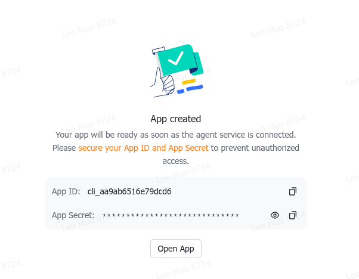

# Feishu / Lark

Feishu (飞书) 是 Atim 的主要使用平台。本文档介绍如何创建飞书机器人并开始使用。

## 创建飞书机器人

### 1. 打开飞书开放平台

访问 [飞书开放平台](https://open.feishu.cn/page/launcher)，点击创建机器人：


### 2. 获取 App ID 和 App Secret

创建完成后，你会看到 App ID 和 App Secret：



可以在 [控制台](https://open.feishu.cn/app) 管理你的应用：


### 3. 配置 Atim

创建配置文件 `~/.atim/config.toml`：

```toml
[im]
backend = "feishu"

[im.feishu]
app_id = "cli_xxxxxxxxxxxxxx"
app_secret = "xxxxxxxxxxxxxxxxxxxxxxxxxx"

[agent]
command = "claude"

[tmux]
session = "atim"
```

或者使用环境变量：

```bash
ATIM_IM_BACKEND=feishu
ATIM_FEISHU_APP_ID=cli_xxxx
ATIM_FEISHU_APP_SECRET=xxxx
```

### 4. 启动 Atim

```bash
atim service --start
```

## 使用方式

### 基本对话

1. 将机器人添加到飞书群聊
2. 在群聊中发送任意消息
3. Atim 自动创建 tmux 窗口并启动 Claude Code
4. 继续对话 — 每条消息都转发给 agent，每个响应都回到群聊

### 话题群聊（推荐）

在飞书群聊中开启「话题」模式，每个话题独立映射到一个 agent 会话：

- 不同话题 = 不同 agent 窗口
- 话题之间互不干扰
- 删除话题 = 清理绑定

### 会话管理

| 命令 | 说明 |
|------|------|
| `/rebind` | 重新绑定当前窗口（agent 重启后修复路由） |
| `/rebind agent` | 重新绑定 agent 类型 |
| `/unbind` | 解绑 session，关闭 tmux 窗口 |
| `/clear` | 清除对话并开启新 session |
| `/status` | 查看 agent 状态 |
| `/ss` | 截图当前终端 |
| `/usage` | 查看 Claude Code 用量 |
| `/switch <agent>` | 切换 agent（claude/copilot/codex） |
| `/esc` | 发送 Escape 键 |
| `/enter` | 发送 Enter 键 |
| `!<command>` | 在 agent 窗口运行 shell 命令 |

### 目录浏览

创建新会话时，Atim 会显示目录浏览器。输入文字可以使用 zoxide 快速跳转到匹配的目录。

### 语音消息

配置 `ATIM_OPENAI_API_KEY` 后，发送语音消息会自动转录为文字再发给 agent。

## 故障排除

### 机器人没有响应

1. 检查服务状态：`atim service --status`
2. 检查日志：`journalctl --user -u atim -f`
3. 确认 App ID 和 Secret 正确
4. 确认机器人已被添加到群聊

### Session 路由丢失

如果 agent 重启后消息无法路由：

```
/rebind
```

这会重新发现 session UUID 并更新绑定。

### 窗口创建在错误目录

如果恢复会话时窗口创建在 HOME 目录而非项目目录：

1. 发送 `/unbind`
2. 重新发送消息，选择正确的项目目录

## 权限配置

飞书机器人需要以下权限：

- `im:message` — 接收和发送消息
- `im:message.group_at_msg` — 接收群聊 @ 消息
- `im:message.group_msg.include_bot:read` — 接收群聊中所有消息（含未 @机器人 的消息，需在飞书后台开启「接收群聊中所有消息」）
- `im:resource` — 发送图片/文件
